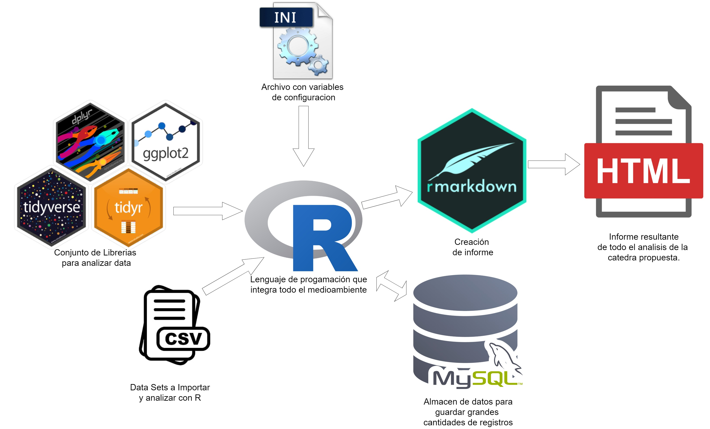

```{r, warning=FALSE}
# Establece el directorio donde están los fuentes a trabajar.
setwd("C:/Users/jorge/OneDrive/MAGISTER/01/PROGRAMACION EN R/EVALUACIONES/EVALUACION 1 (AUTOS)")
```

# Objetivo de investigación

El análisis de la inscripción de vehículos eléctricos en EE.UU. durante los años 2020-2023 proporciona una perspectiva sobre las tendencias y patrones en la adopción de tecnologías de transporte más limpias y sostenibles. Con aproximadamente 181,458 observaciones y 17 variables, este conjunto de datos ofrece una amplia gama de información para explorar.

# Objetivo General

Analizar la inscripción de vehículos eléctricos en EE.UU. durante los años 2020-2023, utilizando técnicas de análisis de datos en R Studio y MySQL, con el objetivo de identificar tendencias y patrones que puedan ser útiles en el aprendizaje académico para el postulante a magister en ciencia de datos.

# Objetivos Especificos

- Analizar la evolución del registro de vehículos eléctricos en EE.UU. hasta el año 2023.
- Identificar tendencias y patrones en el registro de vehículos eléctricos por tipo de vehículo y estado.
- Utilizar técnicas de programación en R Studio, especialmente las librerías del mundo tidyverse, para el análisis de datos.
- Utilizar MySQL para almacenar y gestionar la gran cantidad de registros, aplicando buenas prácticas para agilizar el análisis.

# Librerías Utilizadas
A continuación las librerías utilizadas en este informe. 

```{r message=FALSE, warning=FALSE}
library(ini) # Para leer y escribir archivos de configuración en formato INI.
library(janitor) # Para limpiar y examinar datos en R, incluyendo la normalización de nombres de columnas y la identificación de datos duplicados.
library(conflicted) # Resuelve conflictos de nombre de funciones entre paquetes.
library(tidyverse) # Conjunto de paquetes para manipulación de datos, visualización y análisis.
library(ggthemes) # Proporciona temas adicionales y escalas de color para personalizar gráficos de ggplot2.
library(skimr) # Para resumir datos de manera rápida y concisa, proporcionando estadísticas resumidas útiles.
library(knitr) # Para generar tablas en formato markdown, HTML y otros, en R Markdown.
library(kableExtra) # Extiende las capacidades de 'knitr' para formatear tablas y gráficos en HTML.
library(RMySQL) # Para conectarse a bases de datos MySQL desde R.
library(DBI) # Interfaz para bases de datos, abstrae funciones de bajo nivel.
library(sf) # Proporciona funciones para trabajar con datos espaciales.
library(viridis) # Ofrece paletas de colores perceptiblemente uniformes.
library(stringr) # Proporciona herramientas sencillas, coherentes y rápidas para trabajar con cadenas de caracteres.
library(scales) # Ofrece funciones para la escalación de gráficos y la transformación de datos, facilitando la creación de visualizaciones más claras y efectivas.
```

# Funciones Personalizadas
```{r}
source("funciones_jmb_R.R") # Funciones personalizadas creadas por Jorge Meléndez Bastías para esta cátedra.
```


## conecta_mysql_bd:

**Descripción**: *Establece una conexión a una base de datos MySQL utilizando los parámetros proporcionados*. <br><br>

**Parámetros**:<br>
**dbname**: *Nombre de la base de datos.* <br>
**host**: *Dirección del servidor de la base de datos.* <br>
**port**: *Puerto del servidor de la base de datos.*<br>
**user**: *Nombre de usuario para la base de datos.*<br>
**password**: *Contraseña para la base de datos.*<br>
**client_flag**: *Bandera de cliente, por defecto CLIENT_LOCAL_FILES.*<br><br>

**Retorna**: *Un objeto de conexión a la base de datos.*

```{r}
conecta_mysql_bd <- function(dbname, host, port, user, password, client_flag = CLIENT_LOCAL_FILES) {
  con <- dbConnect(RMySQL::MySQL(),
                   dbname = dbname,
                   host = host,
                   port = port,
                   user = user,
                   password = password,
                   client.flag = client_flag)
  return(con)
}
```

## extract_coordinates

**Descripción**: *Extrae coordenadas de una columna de ubicación en formato POINT y las convierte en un objeto espacial (sf)*.<br><br>

**Parámetros**:<br>
**data**: *Data frame que contiene los datos.*<br>
**location_column**: *Nombre de la columna que contiene las ubicaciones en formato POINT.*<br><br>

**Retorna**: *Un objeto sf con las coordenadas extraídas.*

```{r}

extract_coordinates <- function(data, location_column) {
  # Extraemos todas las observaciones de formato x,y
  coordinates_df <- data.frame(location = data[[location_column]])

  # Extraer las coordenadas
  coordinates <- gsub("POINT \\((-?\\d+\\.\\d+) (-?\\d+\\.\\d+)\\)", "\\1 \\2", coordinates_df$location)

  # Convertir a un dataframe
  coordinates_df <- as.data.frame(do.call(rbind, strsplit(coordinates, " ")))
  colnames(coordinates_df) <- c("lon", "lat")
  coordinates_df$lon <- as.numeric(coordinates_df$lon)
  coordinates_df$lat <- as.numeric(coordinates_df$lat)

  # Crear un objeto espacial
  sf_data <- st_as_sf(coordinates_df, coords = c("lon", "lat"), crs = 4326)

  return(sf_data)
}
```


## conectar_mysql_desde_ini

**Descripción**: *Lee un archivo de configuración .ini para obtener los parámetros de conexión y establece una conexión a una base de datos MySQL*.<br><br>

**Parámetros**:<br>
**archivo_config**: *Ruta del archivo .ini que contiene los parámetros de conexión*.<br><br>

**Retorna**: *Un objeto de conexión a la base de datos MySQL*

```{r}
conectar_mysql_desde_ini <- function(archivo_config) {
  # Leer el archivo .ini
  config <- read.ini(archivo_config)

  # Extraer los valores necesarios
  base <- config$hidden_variables$base
  servidor <- config$hidden_variables$servidor
  puerto <- as.integer(config$hidden_variables$puerto)
  usuarioBD <- config$hidden_variables$usuario
  passBD <- config$hidden_variables$pass

  # Establecer la conexión a la base de datos MySQL
  con <- dbConnect(MySQL(), dbname = base, host = servidor, port = puerto,
                   user = usuarioBD, password = passBD)

  # Retornar la conexión
  return(con)
}
```

## reemplaza_ceros_medianas

**Descripción**: *Reemplazar los valores cero en una columna específica de un dataframe con la mediana de los valores no cero de esa columna*.<br><br>

**Parámetros**:<br>
**df**: *El dataframe que contiene los datos*.<br>
**columna**: *El nombre de la columna en el dataframe donde se desea realizar el reemplazo de ceros*.<br>

**Retorna**: *La función devuelve el dataframe con los ceros en la columna especificada reemplazados por la mediana calculada*

```{r}
reemplaza_ceros_medianas <- function(df, columna) {
  # Calcular la mediana para la columna especificada
  median_value <- median(df[[columna]][df[[columna]] != 0], na.rm = TRUE)

  # Reemplazar ceros con la mediana
  df[[columna]][df[[columna]] == 0] <- median_value

  # Devolver el dataframe modificado
  return(df)
}
```


```{r message=FALSE, warning=FALSE}
# Establece preferencias en el uso de funciones filter y lag, dando prioridad a las versiones de dplyr sobre otras posibles definiciones.
conflict_prefer("filter", "dplyr")
conflict_prefer("lag", "dplyr")
```

# Introducción

El conjunto de datos sobre la población de vehículos eléctricos proporciona información detallada sobre los vehículos eléctricos de batería (BEV) y los vehículos híbridos enchufables (PHEV) que están registrados actualmente a través del Departamento de Licencias del Estado de Washington. Los datos incluyen detalles como la marca, el modelo, el año del vehículo y la ubicación de registro. Este conjunto de datos es una valiosa fuente de información para el análisis de la adopción de vehículos eléctricos en la región y está disponible públicamente para su acceso y uso. <br>
El archivo con objetivo de análisis fue descargado de la siguiente url [https://catalog.data.gov/](https://catalog.data.gov/dataset/electric-vehicle-population-data)

## Arquitectura

*La arquitectura se centra en el uso del lenguaje de programación R como herramienta principal para el análisis y modelado de datos. Los datos se importan en R desde diversas fuentes, como archivos CSV en este caso y son almacenadas en base de datos MySQL. Una vez en R, se utilizan varios paquetes para procesar y analizar los datos. Entre estos paquetes se incluyen `tidyverse` para la ciencia de datos, `ggplot2` para la visualización de datos, `dplyr` para la visualización de datos  y `rmarkdown` para la creación de documentos dinámicos. Los resultados del análisis se pueden exportar en varios formatos, incluyendo HTML. Además, se utilizan archivos de configuración `.ini` para almacenar variables o ajustes utilizados dentro de este flujo de trabajo.* <br><br><br>
<center>
  {width=100% height=100%}
</center>
<br><br><br>

## Conexión a BD a través de R

Este código en R lee un archivo de configuración "config.ini" y extrae varios parámetros necesarios para conectarse a una base de datos, como el nombre de la base, el servidor, el puerto, el usuario y la contraseña. Luego, utiliza estos parámetros para establecer una conexión a la base de datos mediante la función conectar_mysql_desde_ini.
```{r, warning=FALSE}
# Utiliza la función "conectar_mysql_desde_ini" de funciones_jmb_R donde se le entrega como parametro
# el archivo INI con las variables para conectar a MySQL.

archivo_config <- "config.ini"
con <- conectar_mysql_desde_ini(archivo_config)
```

<br><br><br>

## Lectura de los archivos CSV

```{r}
electric_cars <- read.csv("Electric_Vehicle_Population_Data.csv", sep = ",") 
```


## Descripción del Conjunto de Datos

Para efectos de investigación técnica de R se almacena la información de la meta data del set de datos a analizar en MySQL en la tabla "metadata_vehiculos".<br>
Para propósitos de presentación la tabla se "hermosea" con la función kable.<br> 
```{r, fig.align="center", warning=FALSE}
conjunto_datos <- as_tibble(dbReadTable(con, "metadata_vehiculos"))

kable(conjunto_datos, format = "html") %>%
  kable_styling(bootstrap_options = c("striped", "hover", "condensed", "responsive")) %>%
  add_header_above(c(" " = 1, "Descripción de Variables - Electric Car" = 4)) %>%
  column_spec(1, bold = TRUE) %>%
  row_spec(0, bold = TRUE)
```
# Procesamiento de Datos

## Trabajar con MySQL y R

Se deben realizar algunas configuraciones para el almacén de datos desde R a MySQl

```{r}
# Habilitar local_infile globalmente
# se debe configurar para recibir datos de manera externa.
# tambien ver esta configuracion:
# https://medium.com/@kiena/troubleshooting-dbeaver-public-key-retrieval-is-not-allowed-error-29f203d745c5
# dbExecute(con, "SET @@GLOBAL.local_infile = 1;")
```

## Almacenamiento en MySQL

Este código en R informa sobre el proceso de escribir datos en una base de datos. Primero, muestra un mensaje indicando que la escritura está en curso y la hora actual. Luego, guarda los datos de electric_cars en la tabla "electric_cars" de la base de datos, reemplazando cualquier contenido previo. Finalmente, muestra un mensaje confirmando que los datos se escribieron exitosamente, junto con la hora en que se completó la operación, esto con el fin de saber cuanto se demoró el proceso de inserción en la base de datos.

```{r message=FALSE, warning=FALSE}
message(paste("Escribiendo datos en la base de datos... por favor espera. - ", Sys.time()))
dbWriteTable(con, "electric_cars", electric_cars, overwrite = TRUE, append = FALSE, row.names = FALSE)
message(paste("Datos escritos exitosamente en la base de datos. - ", Sys.time()))
```

## Analisis y Limpieza del data set.

El siguiente código en R realiza una serie de pasos para preparar y limpiar un conjunto de datos sobre vehículos eléctricos. Primero, lee los datos de una base de datos y los convierte a un formato de tabla. Luego, limpia los nombres de las columnas para que sean más manejables. A continuación, transforma ciertas columnas numéricas a caracteres y otras a factores, lo que facilita su análisis. El código identifica y guarda los registros con datos faltantes y, finalmente, elimina esas filas con valores perdidos del conjunto de datos, dejando solo los registros completos para el análisis posterior.

```{r}
# Lectura de datos
electric_cars <- as_tibble(dbReadTable(con, "electric_cars"))

# Limpieza de nombres de columnas
electric_cars <- electric_cars %>% clean_names()

# Limpieza de columnas - Transformación de columnas numeric -> char
electric_cars <- electric_cars %>% 
  mutate_at(vars(postal_code, legislative_district, 
                 legislative_district, dol_vehicle_id, x2020_census_tract), as.character)

# Transformación de columnas de numéricas a factores
electric_cars <- electric_cars %>% 
  mutate_at(vars(model_year, electric_vehicle_type,  
                 clean_alternative_fuel_vehicle_cafv_eligibility), as.factor)

# identificacion de datos perdidos
datos_perdidos <- electric_cars %>% filter(rowSums(is.na(.)) > 0) #414 registros


# Eliminar filas con valores perdidos
electric_cars <- na.omit(electric_cars)
```


## Revisión de data set

Se revisa el data set para ver el resultado después de la aplicación de limpieza.

```{r, fig.align="center", warning=FALSE}
skim(electric_cars)
```


# Análisis Exploratorio de Datos

El objetivo del Análisis Exploratorio de Datos (EDA) es resumir las características principales de los datos, a menudo con métodos visuales. En este informe, se explorarán las variables seleccionadas y se identificarán patrones, anomalías y relaciones entre las variables.

## Vehiculos eléctricos por año.

```{r, fig.align="center", warning=FALSE}
# Crear un gráfico de barras para mostrar la cantidad de autos por año
ggplot(data = electric_cars, aes(x = model_year)) +
  geom_bar() +
  geom_text(stat = "count", aes(label = ..count..), vjust = -0.5, size = 3, color = "black") +
  labs(title = "Cantidad de Autos Eléctricos Registrados por Año",
       x = "Año del Modelo",
       y = "Cantidad de Autos") +
  theme_fivethirtyeight() +
  theme(axis.text.x = element_text(angle = 90, hjust = 1))
```
<br><br>

El gráfico muestra la cantidad de autos eléctricos registrados por año. En el eje horizontal, tenemos los años del modelo (desde 1997 hasta 2025), y en el eje vertical, la cantidad de autos eléctricos. A partir del año 2021, se observa un notable aumento en los registros, indicando una creciente adopción de vehículos eléctricos. En 2023, se registraron aproximadamente 60.000 autos eléctricos.

## Top 20 marcas en el mercado de vehículos eléctricos.

```{r, fig.align="center", warning=FALSE}
# Obtener las 20 marcas con más autos
top_brands <- electric_cars %>%
  count(make, sort = TRUE) %>%
  top_n(20, n)

# Crear una columna que agrupa las marcas en 'Otras' si no están en las top 20
electric_cars <- electric_cars %>%
  mutate(make_grouped = ifelse(make %in% top_brands$make, make, "OTHERS"))

top_brands <- electric_cars %>%
  count(make_grouped, sort = TRUE) 

# Gráfico de barras para mostrar la cantidad de autos por marca (top 20)
ggplot(data = top_brands, aes(x = reorder(make_grouped, -n), y = n)) +
  geom_bar(stat = "identity") +
  labs(title = "Top 20 Marcas con Más Autos Eléctricos",
       x = "Marca",
       y = "Cantidad de Autos") +
  theme_fivethirtyeight() +
  theme(axis.text.x = element_text(angle = 90, hjust = 1))
```
<br><br>

Claramente la predominancia de TESLA en el mercado de autos eléctricos con una cantidad significativamente mayor en comparación con otras marcas reconocidas en el mercado Estadounidense.

## Año de fabricación por marca.

```{r, fig.align="center", warning=FALSE}

ggplot(data = electric_cars, aes(x = as.factor(make), y = as.numeric(as.character(model_year)))) +
  geom_boxplot() +
  labs(title = "Distribución del Año del Modelo por Marca",
       x = "Marca",
       y = "Año del Modelo") +
  theme_fivethirtyeight() +
  theme(axis.text.x = element_text(angle = 90, hjust = 1, vjust = 1),
        legend.position = "none")
```
<br><br>

En el gráfico “Distribución del Año del Modelo por Marca”, se puede observar que las marcas Chevrolet, Ford y Toyota tienen algunos datos atípicos en la distribución de los años de sus modelos.<br>


## Distribución de autos eléctricos por ciudad (top 20)

```{r, fig.align="center", warning=FALSE}
# Obtener las 20 marcas con más autos
top_cities <- electric_cars %>%
  count(city, sort = TRUE) %>%
  top_n(20, n)

# Gráfico de lineas para mostrar las ciudades con mas autos electricos

ggplot(data = top_cities, aes(x = reorder(city, -n), y = n, group = 1)) +
  geom_line(color = "blue") +
  geom_point(color = "red") +
  labs(title = "Top 20 ciudades con Más Autos Eléctricos",
       x = "Ciudad",
       y = "Cantidad de Autos") +
  theme_fivethirtyeight() +
  theme(axis.text.x = element_text(angle = 90, hjust = 1))


```
<br><br>

Seattle es la ciudad con mas automóviles eléctricos contenidos en el set de datos.
Un articulo interesante a revisar es [NPR Network](https://www.kuow.org/stories/electric-vehicles-keep-charging-ahead-in-washington)


## Vehículo en el mapa del estado WA de EEUU.

```{r fig.align="center", message=FALSE, warning=FALSE}

# Llama a la función "extract_coordinates" de funciones_jmb_R
electric_cars_sf <- extract_coordinates(electric_cars, "vehicle_location")

# Lee archivo geospacial SHP
wa <- st_read("shp_2/WSDOT_-_County_Road_(CRAB).shp")

# Convierte la geometría a coordenadas x y y
electric_cars_sf <- electric_cars_sf %>%
  mutate(x = st_coordinates(geometry)[, 1],
         y = st_coordinates(geometry)[, 2])

# Tu código existente
ggplot() +
  geom_sf(data = wa, color = "grey", fill = "lightblue") +
  geom_sf(data = electric_cars_sf, aes(geometry = geometry), color = "blue", alpha = 0.5) +
  labs(title = "Autos Eléctricos en Estado de Washington") +
  theme_fivethirtyeight() + 
  geom_density_2d(data = electric_cars_sf, aes(x = x, y = y), color = "red")

```


<br><br>
  
El mapa muestra la distribución de autos eléctricos en el estado de Washington. La mayor densidad de puntos se encuentra en la ciudad de Seattle como muestran los contornos de densidad.

## Vehículos dada su fuente de alimentación.

```{r, fig.align="center", warning=FALSE}

# Calcular el porcentaje de cada tipo de vehículo eléctrico
electric_cars_segmento <- electric_cars %>%
  count(electric_vehicle_type) %>%
  mutate(percent = n / sum(n) * 100)

electric_cars_segmento

# Gráfico de pastel para mostrar la segmentación del tipo de vehículo eléctrico
ggplot(data = electric_cars_segmento, aes(x = "", y = percent, fill = electric_vehicle_type)) +
  geom_bar(stat = "identity", width = 0.7) +
  geom_text(aes(label = paste0(round(percent), "%")), position = position_stack(vjust = 0.5), size = 10) +
  labs(title = "Segmentación del Tipo de Vehículo Eléctrico",
       fill = "Tipo") +
  theme_fivethirtyeight() +
  theme(plot.title = element_text(hjust = 0.5, size = 14))

```
<br><br>
Existe una gran predominancia de los vehículos con batería (141.707) por sobre los vehiculos hibridos (39.353).

## Elegibilidad de vehículos CAFV

```{r, fig.align="center", warning=FALSE}
# Calcular los porcentajes
cafv_counts <- table(electric_cars$clean_alternative_fuel_vehicle_cafv_eligibility)
cafv_perc <- round(prop.table(cafv_counts) * 100, 2)

# Crear un data frame con los datos
df <- data.frame(
  Elegibilidad = names(cafv_counts),
  Cantidad = as.numeric(cafv_counts),
  Porcentaje = cafv_perc
)

# Gráfico de barras horizontales con porcentajes
ggplot(data = df, aes(x = reorder(Elegibilidad, Cantidad), y = Cantidad, label = paste0(Porcentaje.Freq, "%"))) +
  geom_bar(stat = "identity", fill = "skyblue") +
  geom_text(size = 6) +
  labs(title = "Distribución de Elegibilidad de Vehículos CAFV",
       x = "Elegibilidad",
       y = "Cantidad de Autos") +
  theme_fivethirtyeight() +
  theme(axis.text.y = element_text(size = 10))+
  theme(axis.text.x = element_text(angle = 30, hjust = 1))

```
Los vehículos CAFV suelen ser aquellos que utilizan combustibles alternativos, como electricidad, hidrógeno, gas natural comprimido (GNC) o gas licuado de petróleo (GLP), en lugar de gasolina o diésel tradicionales. Estos vehículos son una parte importante de los esfuerzos para reducir las emisiones de gases de efecto invernadero y mejorar la calidad del aire.

Respecto a la distribución de elegibilidad de vehículos CAFV muestra que la mayoría de los vehículos tienen una elegibilidad desconocida (52.23%) debido a que no se ha investigado su autonomía de batería, seguido por aquellos que son elegibles como vehículos CAFV (36.81%). Un número significativamente menor de vehículos no son elegibles debido a su baja autonomía de batería (10.96%). Esto destaca la importancia de investigar y documentar la autonomía de la batería de los vehículos para una clasificación precisa de su elegibilidad como vehículos CAFV.

# Modelado de Datos

## Remplazo de ceros por la mediana

En este ejercicio académico y de práctica en R, reemplazar los ceros por las medianas en los campos Base.MSRP y Electric_Range es una estrategia válida y comúnmente utilizada para manejar valores faltantes o ceros en los conjuntos de datos. Base.MSRP tiene 178,146 registros en cero de un total de 181,458, y Electric_Range tiene 94,730 registros en cero. Al reemplazar estos ceros con la mediana de los valores no cero, se introduce una estimación razonable basada en la distribución de los valores conocidos. La mediana es una medida robusta de tendencia central menos sensible a los valores extremos que la media. Aunque esta es una simplificación, para este ejercicio en R, la imputación por la mediana es una forma rápida y sencilla de manejar valores faltantes y avanzar con el modelado de los datos

```{r}
# Reemplazo de ceros
electric_cars <- reemplaza_ceros_medianas(electric_cars, "electric_range")
electric_cars <- reemplaza_ceros_medianas(electric_cars, "base_msrp")

# eliminación de datos atipicos -ensucian el gráfico :)-
electric_cars <- electric_cars %>% filter(base_msrp < 120000)
```


## Relación entre BASE MSRP Y ELECTRIC RANGE

```{r fig.align="center", message=FALSE, warning=FALSE}
# Crear el gráfico de dispersión
ggplot(data = electric_cars, aes(x = electric_range, y = base_msrp)) +
  geom_point(alpha = 0.5) +
  geom_smooth(method = "lm", color = "blue", se = FALSE) +  # Agrega la línea de tendencia
  labs(title = "Gráfico de Dispersión de Electric Range vs Base MSRP",
       x = "Electric Range",
       y = "Base MSRP (Miles de Dólares)") +
  scale_y_continuous(labels = dollar_format(scale = 1e-3, prefix = "$", suffix = "K")) +
  theme_minimal()

```
Se muestra la relación entre el rango eléctrico y el precio base sugerido por el fabricante (Base MSRP) de varios vehículos eléctricos. Cada punto representa un vehículo individual. La mayoría de los vehículos se agrupan hacia el extremo inferior de ambos ejes (rango eléctrico entre 0 y 100 y precio sugerido entre 50 mil y 75 mil dolares), lo que indica que estos vehículos tienen un precio base más bajo y un rango eléctrico más corto. Esto es útil para entender cómo el precio de un vehículo eléctrico se relaciona con su capacidad de rango.

El efecto de actualización de ceros por las medianas se puede evidenciar tambien en los datos (base_msrp = 59.900). 

## Regresión Logística

En este análisis, se han implementado modelos de regresión logística para predecir el tipo de vehículo eléctrico (Battery Electric Vehicle - BEV o Plug-in Hybrid Electric Vehicle - PHEV) utilizando datos del conjunto electric_cars. Se han creado variables numéricas para las marcas (cod_make) y para la interacción entre marcas y modelos (cod_model) para facilitar el modelado. Se desarrollaron dos modelos logísticos: uno que incluye tanto cod_make como cod_model junto con electric_range, y otro que solo incluye cod_make y electric_range.

```{r}
# Crea un codigo numerico para make
electric_cars$cod_make <- as.numeric(factor(electric_cars$make))
# Crear una nueva variable que represente la interacción entre "make" y "model"
electric_cars$cod_model <- interaction(electric_cars$make, electric_cars$model)
# Convertir la nueva variable en numérica
electric_cars$cod_model <- as.numeric(factor(electric_cars$cod_model))
```


```{r}
logit_model_1 <- glm(electric_vehicle_type ~ cod_make + electric_range +  
                     cod_model, 
                  family = binomial(), 
                  data = electric_cars)

# Predicciones sobre el conjunto de prueba
probabilities <- predict(logit_model_1, electric_cars, type = "response")
predicted_classes <- ifelse(probabilities > 0.5, 1, 0)

# Evaluar el modelo usando todos los datos
conf_matrix <- table(electric_cars$electric_vehicle_type, predicted_classes)
print(conf_matrix)

accuracy <- sum(diag(conf_matrix)) / sum(conf_matrix)
print(paste("Accuracy:", accuracy))
```


```{r}
logit_model_2 <- glm(electric_vehicle_type ~ cod_make + electric_range, 
                     family = binomial(), 
                     data = electric_cars)

# Predicciones sobre el conjunto de prueba
probabilities <- predict(logit_model_2, electric_cars, type = "response")
predicted_classes <- ifelse(probabilities > 0.5, 1, 0)

# Evaluar el modelo usando todos los datos
conf_matrix <- table(electric_cars$electric_vehicle_type, predicted_classes)
print(conf_matrix)

accuracy <- sum(diag(conf_matrix)) / sum(conf_matrix)
print(paste("Accuracy:", accuracy))
```
En la evaluación de los modelos logísticos, tanto el primer modelo (logit_model_1) que incluye las variables cod_make, electric_range, y cod_model, como el segundo modelo (logit_model_2) que solo considera cod_make y electric_range, mostraron una alta precisión del 99.65%. <br> El segundo modelo (logit_model_2) logró una precisión del 99.65%, con una matriz de confusión que indica 141,681 vehículos BEV clasificados correctamente y 38,737 vehículos PHEV clasificados correctamente.<br> Por otro lado, el primer modelo (logit_model_1) también mostró una precisión del 99.65%, con una matriz de confusión que muestra 141,681 vehículos BEV y 38,737 vehículos PHEV correctamente clasificados.<br> Estos resultados sugieren que, aunque ambos modelos son altamente precisos, la inclusión de cod_model en el primer modelo no mejoró significativamente la precisión en comparación con el segundo modelo. Por lo tanto, **cod_make y electric_range** son variables suficientemente robustas para predecir el tipo de vehículo eléctrico.

# Conclusiones

El uso de herramientas como Markdown para la elaboración de informes ha demostrado ser sumamente beneficioso debido a su simplicidad y claridad en la presentación de datos y análisis. Markdown, en combinación con la capacidad de RStudio para integrarse perfectamente, ofrece un entorno de trabajo limpio y eficiente que facilita enormemente el proceso de análisis y documentación.
<br>
Además, la adopción del lenguaje R ha sido sorprendentemente rápida, incluso para quienes no tienen una extensa experiencia en programación. La abundancia de recursos disponibles en línea, incluyendo comunidades de apoyo como Stack Overflow, ha sido fundamental para resolver dudas y superar desafíos. Estas plataformas ofrecen una vasta cantidad de información y ejemplos que aceleran el aprendizaje y la aplicación de R en distintos contextos.
<br>
Aunque algunas funciones y modelos, como la regresión logística, pueden parecer complejas al inicio, el apoyo de los docentes, compañeros de clase y los recursos en línea permiten implementar soluciones efectivas de manera ágil. Esta experiencia no solo ha ampliado el conocimiento técnico, sino que también ha abierto un mundo de posibilidades tanto a nivel personal como profesional. La capacidad de aplicar estos conocimientos de inmediato en el ámbito laboral es una ventaja significativa, permitiendo una toma de decisiones más informada y basada en datos.
<br>
En resumen, la combinación de Markdown, RStudio y la comunidad de R proporciona una poderosa herramienta para el análisis de datos, facilitando la creación de informes detallados y comprensibles, y fomentando un aprendizaje continuo y colaborativo.

